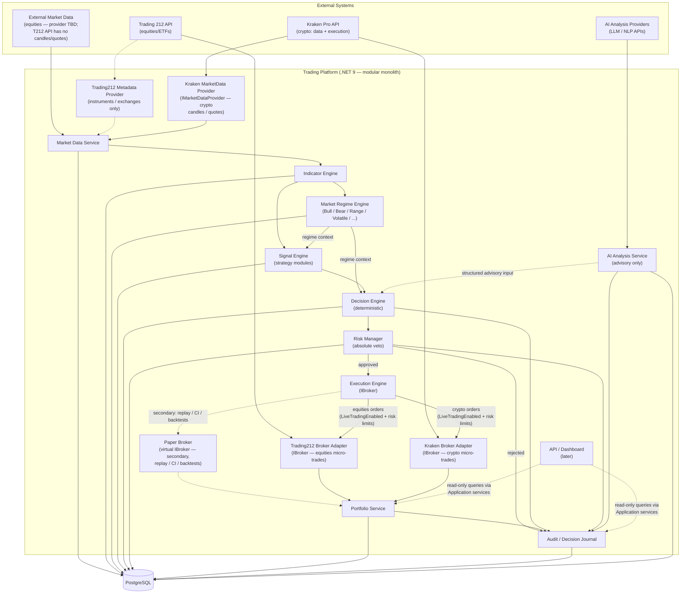
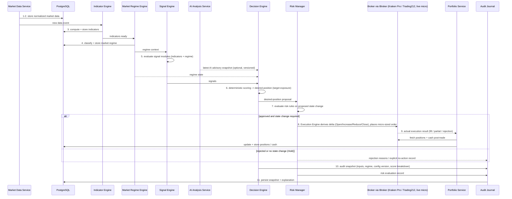

# Solution Architecture — AI-Assisted Trading Decision Platform (MVP)

> **Status:** Draft v0.8 — MVP helicopter view (implementation plan map added)
> **Date:** 2026-07-02
> **Scope:** Architecture only. No implementation code in this phase.
> **Key change vs. v0.1:** MVP executes **real micro-sized trades (~€2–5)** through live broker adapters as the primary path. Paper Broker remains in the architecture as a secondary `IBroker` capability (replay, regression tests, CI, future backtesting) and may not be implemented in the first iterations.
> **Key change vs. v0.3:** Explicit **Decision Philosophy** (point-in-time information only, no look-ahead) and the **Desired Position model** — the Decision Engine outputs a target portfolio state; the Execution Engine derives the actions needed to reach it.
> **Key change vs. v0.4 (→ v0.5):** §9 replaced with **verified Trading 212 API findings**: no crypto via API, no market data at all (external provider now mandatory), quantity-only orders, live = market orders only, full practice environment available.
> **Key change vs. v0.5 (→ v0.6):** **Two execution venues from day one** — **Kraken Pro for crypto** (also serves as crypto market data source) and **Trading 212 for equities/ETFs**. Instruments route to their venue via the instrument master; both venues sit behind the same `IBroker` abstraction.
> **Key change vs. v0.6 (→ v0.7):** §9.4 upgraded to **verified Kraken Pro findings**: micro-order economics confirmed (no per-order minimum fee), OHLC REST limited to ~720 recent candles (CSV archives for backtest bootstrap), spot has balances not positions, no spot sandbox (validate-flag + micro orders), per-pair minimums discoverable via AssetPairs.
> **Key change vs. v0.7 (→ v0.8):** **§16 Implementation Plan Map** added, linking every component to its numbered plan in [docs/implementation](../implementation/README.md); raw provider payloads retained alongside normalized data (§4.1, §8); Feature-Store layer explicitly a non-goal with seams noted (§14).

---

## 1. Executive Summary

This platform is an **explainable, deterministic, AI-assisted trading decision system** — a Trading Decision Engine: its input is the market state *now*, its output is a desired portfolio state with an explanation of *why*. It ingests market data, computes technical indicators, classifies the market regime, evaluates strategy signal modules, deterministically derives the **desired position** (target exposure) per instrument, passes the proposed state change through a Risk Manager with absolute veto power, and lets the Execution Engine translate the difference between desired and current position into broker orders. The MVP executes **real trades from day one through two venues — Kraken Pro for crypto and Trading 212 for equities/ETFs** — at deliberately micro position sizes (~€2–5 per trade) under strict risk limits. The goal is to validate the full production pipeline against real fills, commissions, latency, rejections, and market behavior instead of an idealized simulator. Every decision cycle is fully audit-logged and reproducible: given the same inputs and configuration, the system must produce the same decision and be able to explain why.

AI is strictly an **advisor**: it may supply structured analytical inputs (news sentiment, macro summaries, risk flags, anomaly explanations, confidence metadata), but it never issues orders, never bypasses risk controls, and never mutates portfolio state. The deterministic Decision Engine is the only component that produces trade decisions.

The MVP is a single .NET 9 modular monolith running in Docker with PostgreSQL, delivering one complete vertical slice: **market data → indicators → market regime → signals → decision → risk evaluation → live micro-execution → portfolio update → audit journal**. Both venues sit behind the mandatory broker abstraction, and each instrument is routed to its execution venue by the instrument master; the architecture is broker-agnostic by design. Kraken Pro additionally serves as the **crypto market data source** (candles, quotes, streaming), while equities data requires a separate external provider — Trading 212's API supplies no market data. A **Paper Broker** remains a first-class `IBroker` implementation in the architecture — used later for replay-from-snapshot, regression testing, CI, and backtesting — but it is a secondary capability, not the MVP execution path. Live trading requires `LiveTradingEnabled=true` in configuration plus fully configured risk limits; because every MVP trade uses real capital, the Risk Manager and kill switch are hard requirements, not future work.

---

## 2. Architecture Principles

| # | Principle | Meaning |
|---|-----------|---------|
| 1 | **Deterministic decisions** | Same inputs + same config ⇒ same decision. No randomness, no hidden state, no LLM in the decision path. |
| 2 | **AI as advisor only** | AI produces structured, versioned analytical inputs. It is one input among many; never a decision-maker. |
| 3 | **Risk Manager veto** | Every decision passes through the Risk Manager. It can reject any decision. Nothing can override a rejection. |
| 4 | **Broker abstraction** | All execution goes through `IBroker`. Trading 212 is one adapter. The Paper Broker is a full `IBroker` implementation, not `if`-statements in business logic — business logic never knows which broker it talks to. |
| 5 | **Market data ≠ execution** | Market data providers and execution brokers are separate abstractions. A broker may also supply data, but the contracts never merge. |
| 6 | **Reproducibility** | Every decision cycle snapshots its inputs so it can be deterministically **replayed from persisted snapshots**. Replay never re-invokes external systems — no AI calls, no broker calls, no data-provider calls. It depends only on what we stored. |
| 7 | **Auditability** | Every decision, risk evaluation, order, and AI analysis is journaled with a human-readable explanation. |
| 8 | **MVP-first** | Smallest useful vertical slice. Modular monolith, one database, no premature distribution. |
| 9 | **Docker-first** | Everything runs via `docker compose` from day one. No host-machine dependencies. |
| 10 | **Testability** | All boundaries are interfaces; deterministic core logic is unit-testable without brokers, databases, or wall-clock time (time is an input to the pipeline, not something it reads). |
| 11 | **Real capital, micro risk** | MVP trades real money from day one, but every order is micro-sized (~€2–5) and every decision passes hard risk limits and a kill switch. Live trading still requires explicit `LiveTradingEnabled=true` in configuration + fully configured risk limits — the system fails safe (no order) on any doubt. |
| 12 | **Point-in-time information only** | A decision at time T may use only information that existed at time T. No future data, ever, in any mode (§2.1). |
| 13 | **Decide state, execute deltas** | The Decision Engine outputs the *desired portfolio state*; the Execution Engine derives the broker actions needed to reach it (§2.2). |

### 2.1 Decision Philosophy

**The system never attempts to predict future prices, and never tries to identify perfect tops or bottoms.** A human looking at yesterday's chart says "the bot should have bought at 03:30 and sold at 07:00" — but that judgment uses knowledge of what happened *after* 03:30. At 03:30 the system knows only what happened up to 03:30.

The objective is therefore not "find the ideal entry/exit points" but **make decisions that have positive expected value on average**, each one answering a single question:

> *"Given only the information available right now, should the portfolio position change?"*

Every evaluation is independent and may use **only**:

- market data available up to the current timestamp
- historical data available up to the current timestamp
- indicators calculated from that data
- the current market regime state
- the current portfolio state
- the current risk state
- the latest valid AI advisory snapshots (created before the current timestamp)

The system must **never** use future candles, future prices, future news, future indicator values, or any information that would not have been available at the decision timestamp. This prohibition is the defense against **look-ahead bias** — the classic failure mode where a strategy quietly consumes knowledge of the future, produces spectacular backtests, and then cannot reproduce them in live trading.

This principle applies identically to **live trading, replay, backtesting, and future simulations**. The decision pipeline is the same code in every mode; only the market data source and the `IBroker` implementation differ. Backtesting therefore answers exactly the question that matters: *"if this moment were now, with only what was knowable then, what would the system have done?"*

### 2.2 Desired Position Model

The Decision Engine does **not** emit trade commands (BUY/SELL). It emits the **desired position** — the target exposure for an instrument:

```
NONE | LONG 10% | LONG 25% | LONG 50% | LONG 100%     (SHORT reserved for the future)
```

where the percentage is a fraction of the configured **maximum per-instrument allocation** (a risk-limit parameter, not a free number). The Execution Engine then compares desired vs. current position and derives the required action:

| Current | Desired | Action |
|---|---|---|
| NONE | LONG 25% | **Open** position |
| LONG 25% | LONG 50% | **Increase** (scale in) |
| LONG 50% | LONG 20% | **Reduce** (partial exit) |
| LONG 25% | NONE | **Close** position |
| LONG 40% | LONG 40% | **No action** (hold) |

Why this model instead of BUY/SELL/HOLD:

- it cleanly **separates decision-making from execution** — the Decision Engine reasons about exposure, the Execution Engine reasons about orders;
- partial exits, scaling in, and scaling out fall out **naturally** instead of requiring duplicated BUY/SELL special cases;
- the audit trail becomes clearer: every cycle records "desired state X, current state Y, therefore action Z";
- it matches how professional portfolio management systems work, so the architecture scales without redesign.

**MVP clarification:** although the architecture supports arbitrary target exposures, the MVP Risk Manager intentionally clamps exposure to very small real positions (~€2–5), normally allowing only a single micro position per instrument — in practice MVP desired states collapse to `NONE` / `LONG (micro)`. This is a **risk policy, not an architectural limitation**; scaling up later is a config change, not a redesign.

### 2.3 Evaluation Cycle

The platform runs a continuous evaluation loop on a **configurable, strategy-dependent interval** (e.g., every N seconds/minutes, or on candle close — see Open Questions #12; the interval must respect broker/provider rate limits and the fee drag of micro orders):

```
Every N seconds (configurable):
 1. Refresh market data
 2. Update indicators
 3. Detect current market regime
 4. Evaluate signal modules
 5. Build deterministic decision score → desired position
 6. Run all risk rules against the proposed state change
 7. Compare desired portfolio state with current portfolio state
 8. If a state change is required: Open / Increase / Reduce / Close
    otherwise: Hold (no order)
 9. Execute through IBroker
10. Store complete audit snapshot
```

Each cycle is self-contained: it re-evaluates the market from scratch using only point-in-time information (§2.1) and produces either orders or an explicit, audit-logged "no action".

---

## 3. High-Level Component Diagram



Key flow properties:

- **AI input is a dashed line** into the Decision Engine: optional, advisory, and versioned. The engine must function with AI input absent.
- **The Market Regime Engine is deterministic state, not opinion.** It classifies the current market (trend, volatility, liquidity, event flags) from data and indicators; signals and the Decision Engine consume it as context (e.g., "EMA crossover says BUY, but regime = High Volatility → confidence reduced").
- **The Execution Engine talks only to `IBroker`.** Two live adapters exist from day one — **Kraken Pro for crypto, Trading 212 for equities/ETFs** — and each instrument is routed to its venue by the instrument master. The Paper Broker is a secondary implementation for replay, CI, and backtesting.
- **Broker and market data contracts never merge, even within one venue.** Kraken contributes two separate adapters (`KrakenBrokerAdapter : IBroker` and `KrakenMarketDataProvider : IMarketDataProvider` — crypto candles/quotes); Trading 212 contributes `Trading212BrokerAdapter : IBroker` and `Trading212MetadataProvider` (reference data only — its public API has no candles or quotes, so equities price data comes from a separate external provider).
- **The API never queries PostgreSQL directly** — it reads through Application services / read models over the same persistence layer.
- **Everything writes to the Audit Journal**, including rejections.

### 3.1 Execution Modes

| Mode | Broker | Purpose | MVP status |
|---|---|---|---|
| **Replay / Backtest** | Paper Broker (`IBroker`) | Historical data, deterministic replay, regression tests, CI. No external calls. | Architecture-ready; implementation may be deferred |
| **Live Micro** | Kraken Pro (crypto) + Trading 212 (equities) adapters | Real trades at ~€2–5 per order under strict risk limits. Validates real fills, slippage, partial fills, rejections, market hours / 24/7 behavior. | **Primary MVP mode** |
| **Live** | Same adapters (later: others) | Normal position sizes, once the MVP has proven itself. | Post-MVP; unlocked only by raising risk limits, no code change |

The mode is a configuration concern at the Execution Engine — the pipeline upstream of `IBroker` is identical in all three modes.

---

## 4. Bounded Contexts

### 4.1 Market Data
- **Responsibility:** Ingest, normalize, and store market data (candles, quotes) from external providers. **Raw provider payloads are retained alongside normalized data** — if a normalization bug is found later, history can be re-parsed from the raw record instead of being lost.
- **Owns:** Instrument price history (raw + normalized), data-quality metadata (gaps, staleness), provider adapters behind `IMarketDataProvider`, and the **instrument registry** (venue routing, per-pair precision/minimums, trading calendars — reference data consumed by Execution for routing and order constraints, so Execution never knows venue specifics itself).
- **Must not own:** Trading decisions, indicator math, broker credentials.
- **Key interfaces:** `IMarketDataProvider`, internal `IMarketDataStore`.

### 4.2 Indicators
- **Responsibility:** Compute deterministic technical indicators (SMA, EMA, RSI, ATR, …) from stored market data.
- **Owns:** Indicator definitions, parameterization, computed indicator series.
- **Must not own:** Signal semantics ("RSI < 30 means buy" belongs to Signals), data ingestion.
- **Key interfaces:** `IIndicatorEngine`, `IIndicator`.

### 4.3 Market Regime
- **Responsibility:** Deterministically classify the current market state per instrument/market from market data and indicators: trend (Bull / Bear / Range), volatility bucket (Normal / High), liquidity (High / Low), and event flags (e.g., news freeze, flash-crash guard). MVP implementation is deliberately simple — a rule-based classifier (e.g., trend filter + ATR-based volatility bucket) — but the component exists as its own bounded context from day one so regime awareness is never bolted onto Strategy or Decision code later.
- **Owns:** Regime taxonomy, classification rules and their versions, regime state history.
- **Must not own:** Signals, decisions, risk verdicts — regime is **descriptive state, not a trade opinion**. It must not consume AI output: regime is computed deterministically; AI-derived risk flags enter the Decision Engine separately.
- **Key interfaces:** `IMarketRegimeEngine`.

### 4.4 Signals / Strategies
- **Responsibility:** Evaluate pluggable strategy modules that emit directional signals with strength/confidence, computed **only** from market data, indicators, and the current Market Regime state.
- **Owns:** Strategy module registry, signal outputs, strategy parameters/versions.
- **Must not own:** Final decisions, position sizing, risk checks, order placement, **AI input** — AI advisory data enters the pipeline exclusively as an `AIAnalysisSnapshot` input feature of the Decision Engine, never inside strategy modules. This keeps signals pure and prevents AI from leaking into strategy logic.
- **Key interfaces:** `ISignalModule`.

### 4.5 Decisioning
- **Responsibility:** Deterministically combine signals, the current Market Regime state, the current portfolio state, and structured AI metadata into a scored **desired-position proposal** (target exposure per instrument, §2.2) with a full explanation of contributing factors (including regime-driven confidence adjustments).
- **Owns:** Scoring/weighting configuration, decision records (desired state + score breakdown), explanation payloads.
- **Must not own:** Risk approval (that's Risk Management), order derivation (that's Execution — the Decision Engine states *what the position should be*, never *which orders to place*), portfolio mutation.
- **Key interfaces:** `IDecisionEngine`.

### 4.6 Risk Management
- **Responsibility:** Evaluate every decision proposal against configured risk rules; approve, reject, or shrink. Absolute veto power.
- **Owns:** Risk rule set and limits, risk evaluation records, kill switches (trading-disabled flag, cooldowns).
- **Must not own:** Signal or scoring logic, broker communication.
- **Key interfaces:** `IRiskManager`, `IRiskRule`.

### 4.7 Execution / Broker Abstraction
- **Responsibility:** Translate an approved desired-position transition into concrete broker actions by comparing desired vs. current position (Open / Increase / Reduce / Close / no-op, §2.2); convert target notional to instrument quantity (the T212 API is quantity-based — no value orders, §9.2); route orders via a single abstraction; track order lifecycle (submitted → filled / partially filled / rejected), including real-world outcomes: slippage, partial fills, broker rejections, market-closed errors.
- **Owns:** `IBroker` contract, order records, broker adapters (Kraken Pro and Trading 212 — live; Paper Broker — secondary), **instrument→venue routing** (from instrument master mappings), the `LiveTradingEnabled` and execution-mode enforcement point.
- **Must not own:** Decision or risk logic, portfolio valuation.
- **Key interfaces:** `IBroker` (Paper Broker implements it fully; `IPaperBroker` extends it with simulation controls).

### 4.8 Portfolio
- **Responsibility:** Track positions, cash, exposure, realized/unrealized P&L; produce portfolio snapshots. Since MVP trades real money, after every executed trade the service fetches the broker's state (positions on T212; **balances on Kraken — spot has no positions**, so average entry and P&L are derived from our own recorded fills, cross-checked against the broker's trade history, §9.4) and stores it alongside local state — a simple post-trade refresh, **not** a reconciliation subsystem (continuous reconciliation with automated drift handling is a post-MVP production feature).
- **Owns:** Position state (including reconstruction for balance-only venues), portfolio snapshots, P&L calculation, stored broker-reported position/balance/cash snapshots.
- **Must not own:** Order placement, decision logic. Portfolio state is mutated **only** by execution results (fills), never by AI or strategies.
- **Key interfaces:** `IPortfolioService`.

### 4.9 Audit / Replay
- **Responsibility:** Immutable journal of every decision cycle: inputs, indicator values, regime state, signals, decision, risk evaluation, execution result, explanation. Supports **replay from persisted snapshots** — replay reads only what was stored and never re-invokes AI, brokers, or data providers.
- **Owns:** Audit snapshots, decision explanations, replay reconstruction.
- **Must not own:** Any live behavior — it is write-once, read-many; it never influences decisions.
- **Key interfaces:** `IAuditJournal`.

### 4.10 AI Analysis
- **Responsibility:** Call external AI providers to produce **structured, schema-validated** advisory artifacts (sentiment, risk flags, macro summaries, anomaly explanations) with confidence metadata.
- **Owns:** Provider adapters behind `IAIAnalysisProvider`, AI analysis snapshots (prompt/model/version/output), output schemas.
- **Must not own:** Any decision, execution, risk, or portfolio capability. Its outputs are data, not commands.
- **Key interfaces:** `IAIAnalysisProvider`.

### 4.11 Configuration
- **Responsibility:** Versioned configuration for strategies, scoring weights, regime classification rules, risk limits, and the `LiveTradingEnabled` setting (default `false`). Plain .NET configuration (appsettings + environment variables) — no feature-flag service or framework in MVP.
- **Owns:** Config schema, config versions referenced by audit snapshots (a decision must record which config version produced it).
- **Must not own:** Business logic.
- **Key interfaces:** typed options/config accessors; config version stamping.

### 4.12 API / UI
- **Responsibility (post-MVP):** Read-mostly HTTP API and dashboard for decisions, portfolio, and audit browsing; controlled config changes.
- **Owns:** Presentation and API contracts.
- **Must not own:** Any trading logic. MVP ships only a minimal health/status API.

---

## 5. MVP Runtime Flow

One decision cycle, end to end:

1. New market data received (poll or push) and normalized.
2. Data stored in PostgreSQL.
3. Indicator Engine computes indicators for affected instruments.
4. Market Regime Engine classifies the current regime (trend / volatility / liquidity / event flags) and stores it.
5. Signal modules evaluate (indicators + regime context) and emit signals.
6. Decision Engine computes a deterministic score → **desired position** (target exposure) from signals + regime state + current portfolio state + AI advisory snapshot if available.
7. Risk Manager evaluates all risk rules against the proposed state change → approve / reject / resize (micro position sizes enforced here).
8. The Execution Engine compares desired vs. current position, derives the required action (Open / Increase / Reduce / Close, or no order for Hold), routes the order to the instrument's venue (Kraken Pro for crypto, Trading 212 for equities), and the adapter places the real micro-sized order and reports the actual outcome (fill, partial fill, slippage, rejection, market closed).
9. Portfolio Service applies the actual fill; positions and cash are fetched from the executing broker after the trade and stored.
10. Audit Journal stores a complete snapshot of the cycle (inputs, regime, config version, outputs).
11. A human-readable explanation is generated and stored with the snapshot.



Notes:

- The cycle is **synchronous and single-threaded per instrument** in MVP — simplest path to determinism.
- AI analysis runs **out-of-band** (its own schedule); the decision cycle only reads the latest stored snapshot, never blocks on an AI call.
- The pipeline up to the `IBroker` boundary is identical in every execution mode; only the broker adapter behind the Execution Engine changes (Trading 212 live-micro in MVP, Paper Broker for replay/CI later).
- Execution results are recorded **as reported by the broker** (real price, real fees, partial fills) — decisions are deterministic, execution outcomes are observed facts.

---

## 6. Service / Project Structure Proposal

Single .NET 9 solution, modular monolith, two deployables (`Api`, `Worker`):

```
src/
  TradingBot.Api                      # Minimal HTTP API: health, status, audit read (thin)
  TradingBot.Worker                   # Hosted service running the decision loop
  TradingBot.Domain                   # Entities, value objects, domain interfaces (no dependencies)
  TradingBot.Application              # Decision cycle orchestration, Market Regime Engine, Decision Engine, Risk Manager, use cases
  TradingBot.Infrastructure           # Cross-cutting: config, logging
  TradingBot.Persistence              # EF Core / PostgreSQL repositories, migrations
  TradingBot.Connectors.Trading212    # Equities venue. Two separate adapters, contracts never mixed:
                                      #   Trading212BrokerAdapter     : IBroker
                                      #   Trading212MetadataProvider  : instruments/exchanges reference data
                                      #   (no candles/quotes in the public API — equities prices come from Connectors.MarketData)
  TradingBot.Connectors.Kraken        # Crypto venue. Two separate adapters, contracts never mixed:
                                      #   KrakenBrokerAdapter         : IBroker
                                      #   KrakenMarketDataProvider    : IMarketDataProvider (crypto candles/quotes)
  TradingBot.Connectors.MarketData    # External market data provider adapter(s)
  TradingBot.AI                       # IAIAnalysisProvider adapters, output schema validation

tests/
  TradingBot.UnitTests                # Deterministic core: indicators, signals, decisions, risk rules
  TradingBot.IntegrationTests         # Postgres + paper broker end-to-end cycle

docs/
  architecture/
```

Dependency direction: `Api`/`Worker` → `Application` → `Domain`; `Persistence`, `Connectors.*`, `AI`, `Infrastructure` implement `Domain`/`Application` interfaces and are wired via DI.

**Why this is sufficient for MVP — and what NOT to split:**

- One process (`Worker`) runs the whole decision cycle in-memory. This maximizes determinism, debuggability, and testability, and eliminates network failure modes between components.
- The Paper Broker lives inside the monolith as an `IBroker` implementation — no separate service needed. Its implementation may be deferred past the first iterations; only the `IBroker` seam must exist from day one.
- **Do not split into microservices yet:** no separate market-data service, execution service, or risk service. The bounded contexts are enforced by project boundaries and interfaces, which gives the same modularity at ~5% of the operational cost. If a component later needs independent scaling (e.g., data ingestion), the interface seams already exist.
- **No message broker yet:** in-process events/mediator suffice for one worker. Revisit only if multiple processes need to coordinate.
- `docker-compose.yml` at repo root: `api`, `worker`, `postgres`.

---

## 7. Key Interfaces

Conceptual contracts (illustrative pseudo-code, not final signatures):

### `IMarketDataProvider`
Abstracts any market data source (external provider or a broker that also serves data).

```csharp
interface IMarketDataProvider
{
    Task<IReadOnlyList<Candle>> GetCandlesAsync(InstrumentId id, Timeframe tf, DateRange range);
    Task<Quote> GetLatestQuoteAsync(InstrumentId id);
    Task<IReadOnlyList<Instrument>> GetInstrumentsAsync();
}
```

### `IBroker`
The single execution abstraction. The Trading 212 adapter (primary) and Paper Broker (secondary) both implement it.

```csharp
interface IBroker
{
    Task<AccountInfo> GetAccountAsync();
    Task<IReadOnlyList<Position>> GetPositionsAsync();
    Task<OrderResult> PlaceOrderAsync(OrderRequest request);   // guarded by LiveTradingEnabled + risk limits in the Execution Engine
    Task<OrderStatus> GetOrderStatusAsync(OrderId id);
    BrokerCapabilities Capabilities { get; }                   // order support, order types, min order size, etc.
}
```

`OrderResult`/`OrderStatus` must model real-world outcomes from day one: filled, partially filled, rejected, market closed, actual fill price and fees.

### `IPaperBroker`
Extends `IBroker` with simulation controls only. Business logic never knows it is talking to paper. Secondary capability (replay, regression tests, CI, backtesting) — implementation may be deferred, the interface may not.

```csharp
interface IPaperBroker : IBroker
{
    Task ResetAsync(decimal startingCash);
    void ConfigureFillModel(FillModel model);   // e.g., fill at next quote, slippage, fees
}
```

### `IMarketRegimeEngine`
Deterministic classifier of current market state. Rule-based in MVP; its output is descriptive context, never a trade opinion.

```csharp
interface IMarketRegimeEngine
{
    string Version { get; }
    RegimeState Classify(RegimeContext ctx);   // ctx: candles + indicators; no AI input
    // RegimeState: trend (Bull/Bear/Range), volatility bucket, liquidity, event flags
}
```

### `ISignalModule`
A pluggable strategy unit. Pure function of its inputs.

```csharp
interface ISignalModule
{
    string Name { get; }
    string Version { get; }
    Signal Evaluate(SignalContext ctx);   // ctx: indicators + recent candles + regime state — no AI input here
    // Signal: direction (Long/Short/Neutral), strength [0..1], contributing factors
}
```

AI advisory data is deliberately absent from `SignalContext`: it enters the pipeline only as an `AIAnalysisSnapshot` inside `DecisionContext`.

### `IDecisionEngine`
Deterministically aggregates signals into one scored desired-position proposal with explanation. It states *what the position should be*, never *which orders to place*.

```csharp
interface IDecisionEngine
{
    DecisionProposal Decide(DecisionContext ctx);
    // ctx: signals + regime state + current portfolio state + optional AIAnalysisSnapshot
    // DecisionProposal: instrument, desired position (e.g. None / Long 25% of max allocation),
    // confidence, score breakdown per signal, regime adjustments, config version, explanation
}
```

The Execution Engine (behind `IBroker`) compares the approved desired position with the current position and derives the concrete action: Open, Increase, Reduce, Close, or no order (§2.2).

### `IRiskRule` / `IRiskManager`
Composable rules; the manager runs all rules and any single rejection vetoes.

```csharp
interface IRiskRule
{
    string Name { get; }
    RiskVerdict Evaluate(DecisionProposal proposal, PortfolioState portfolio, RiskLimits limits);
    // Evaluates the proposed state transition (current -> desired position)
    // RiskVerdict: Approve | Reject(reason) | Resize(newTargetExposure, reason)
}

interface IRiskManager
{
    RiskEvaluation Evaluate(DecisionProposal proposal, PortfolioState portfolio);
    // Runs all IRiskRules; result is Rejected if ANY rule rejects. Fully logged.
}
```

### `IPortfolioService`
```csharp
interface IPortfolioService
{
    Task<PortfolioState> GetStateAsync();
    Task ApplyFillAsync(Fill fill);          // the ONLY mutation path
    Task<PortfolioSnapshot> SnapshotAsync();
}
```

### `IAuditJournal`
```csharp
interface IAuditJournal
{
    Task RecordCycleAsync(DecisionCycleSnapshot snapshot);  // append-only
    Task<DecisionCycleSnapshot> GetCycleAsync(CycleId id);  // for replay/explanation
}
```

### `IAIAnalysisProvider`
```csharp
interface IAIAnalysisProvider
{
    Task<AIAnalysisSnapshot> AnalyzeAsync(AIAnalysisRequest request);
    // Snapshot: structured JSON validated against schema, provider/model/version,
    // confidence metadata, timestamp. Stored verbatim; never contains order instructions.
}
```

---

## 8. Data Storage Model

MVP uses **one PostgreSQL instance** with clean logical separation — either schemas per context (`marketdata`, `trading`, `audit`, `ai`) or a strict table-prefix convention. No cross-context foreign keys except by ID reference.

| Logical group | Contents | Notes |
|---|---|---|
| **Market data** | Candles, quotes, provider/source metadata — normalized, plus retained raw provider payloads | Append-only; time-series indexed (consider TimescaleDB later, not MVP); raw payloads allow re-parsing after normalization fixes |
| **Instruments** | Instrument master: symbol, exchange/venue, currency, asset class, broker mappings, trading calendar | Maps internal `InstrumentId` to per-broker/provider identifiers and routes each instrument to its execution venue (Kraken Pro = crypto 24/7, Trading 212 = equities with market hours) |
| **Indicators** | Computed indicator values per instrument/timeframe/params | Recomputable; stored for reproducibility and replay speed |
| **Market regimes** | Regime state per instrument/market per cycle, with classifier rule version | Consumed by signals and decisions; part of every audit snapshot |
| **Signals** | Signal module outputs per cycle, with module name + version | |
| **Decisions** | Decision proposals: desired position (target exposure), score breakdown, derived action, config version, explanation | Explicit "no action" (Hold) cycles are recorded too |
| **Risk evaluations** | Per-rule verdicts, final approve/reject, limits in force at the time | Rejections stored just like approvals |
| **Orders** | Order requests, broker (paper/live), lifecycle states, fills | |
| **Positions** | Current open positions per broker context (live vs. paper are separate) | Includes broker-reported positions/cash fetched after each trade (full reconciliation subsystem is post-MVP) |
| **Portfolio snapshots** | Periodic and post-fill portfolio state: cash, exposure, P&L | |
| **Audit snapshots** | Immutable per-cycle record: input references + hashes, config version, all outputs | Append-only; the replay source of truth |
| **AI analysis snapshots** | Raw structured AI output, prompt/model/version, confidence | Stored verbatim so decisions referencing them are reproducible |

Principles: audit and market data tables are append-only; every decision row references the exact config version, signal versions, and AI snapshot IDs it consumed.

---

## 9. Broker Platform Considerations

Two execution venues, both behind `IBroker`: **Trading 212** (equities/ETFs) and **Kraken Pro** (crypto). Each instrument routes to exactly one venue via the instrument master.

> Both venues' findings are verified against official API documentation and community reports as of **2026-07-02** (research-assisted review): Trading 212 in §9.1–9.3, Kraken Pro in §9.4. "Verified" means documentation-verified — each venue still requires an empirical pass (T212: practice account; Kraken: `validate` flag + live `AssetPairs` queries) before its first live order. The T212 API is explicitly **beta** and actively changing.

### 9.1 Trading 212 — verified findings

| Topic | Finding | Source confidence |
|---|---|---|
| **Authentication** | API key + secret via HTTP Basic auth; per-key permission flags (account data, orders, portfolio, …) and optional IP restrictions. Separate environments with distinct base URLs: `demo.trading212.com/api/v0` and `live.trading212.com/api/v0`. Available for Invest and Stocks & Shares ISA accounts only. | Official docs |
| **Practice environment** | Full demo environment exists — the adapter can be integration-tested end-to-end without risking funds. | Official docs |
| **Order types** | Market, limit, stop, stop-limit are documented, **but docs indicate only MARKET orders are supported in the live environment**. No bracket / attached TP-SL orders. | Official docs (needs empirical check) |
| **Order sizing** | **Quantity-based only — value/notional orders are not supported.** Fractional quantities are supported. Orders execute only in the main account currency. No published minimum notional. | Official docs |
| **Order lifecycle** | Rich status enum (`NEW`, `PARTIALLY_FILLED`, `FILLED`, `REJECTED`, `CANCELLED`, `REPLACED`, …) — maps cleanly onto our order model. | Official docs |
| **Instrument universe** | **Equities and ETFs only** (`/equity/...` namespace); metadata endpoints for exchanges and instruments. **Crypto (e.g., SOL/EUR visible in the app) is NOT accessible via the public API.** | Official docs (absence of any crypto endpoint) |
| **Market data** | **None.** No historical candles/OHLCV, no quotes, no WebSocket/streaming. The API surface is reference data (instruments/exchanges) + account/trading data only. | Official docs (absence) |
| **Rate limits** | Documented per endpoint and enforced **per account** (regardless of key/IP): e.g., account summary 1 req/5s, market orders 50 req/min, other order types 1 req/2s. `x-ratelimit-*` response headers available. | Official docs |
| **Portfolio data** | Positions (quantity, average price, P&L), account summary (cash, invested, total value), pending/historical orders, dividends, transactions, CSV reports. **Multi-currency accounts not supported via API** — everything in the primary account currency. | Official docs |
| **Fees** | Not covered by the API docs at all; round-trip cost of a €2–5 order is unknown until measured. | Not available |
| **Reliability** | Explicitly beta; no SLA or status page found; community reports active surface changes (live market orders were added during 2025). | Official + community |
| **ToS / algo trading** | API Terms do not clearly authorize or forbid fully automated strategies — must be read directly (API Terms PDF) before live trading. | Unresolved |

### 9.2 Trading 212 — architectural consequences

1. **An external market data provider is mandatory for equities.** Trading 212 supplies no candles and no quotes — indicators, regime, signals, and backtesting for the equities side all depend on a third-party feed (crypto data comes from Kraken, §9.4). Open Question #3 remains blocking for the equities track.
2. **The T212 universe = EUR-denominated equities/ETFs.** Crypto is not available via this API — it routes to Kraken Pro (§9.4). Orders execute only in the account currency and multi-currency is unsupported, so this universe should avoid FX entirely. Market-hours handling is required on this venue.
3. **The Execution Engine converts notional to quantity.** The desired micro exposure (€2–5) becomes `quantity = notional / current price` (price from our market data provider), respecting fractional precision. Actual filled notional will deviate slightly (market-order slippage, price staleness) — risk limits need a small tolerance buffer above the nominal cap.
4. **Live trading means market orders only (per current docs).** Server-side stops are unavailable in live, which confirms the §11 stance: stop-loss/take-profit are platform-monitored — the evaluation cycle checks levels and emits Close/Reduce decisions.
5. **Polling is confirmed** (no streaming exists). The evaluation cadence must fit per-endpoint budgets, and since limits are per account, all components share one budget — the Trading212 adapter should centralize rate-limit accounting and honor `x-ratelimit-*` headers.
6. **Practice environment first.** The T212 adapter is validated end-to-end against `demo.trading212.com` before any live order is routed to this venue (venue-level gating, independent of the Kraken track).

### 9.3 Trading 212 — still to verify empirically (practice account)

- Do limit/stop/stop-limit orders actually work in the demo environment, and does live really reject them?
- Effective minimum order quantity/precision per instrument (docs publish no minimum notional).
- Actual fees/FX behavior on small orders — measure the real round-trip cost of a €2–5 trade.
- Full response schemas (docs are non-exhaustive; capture real payloads).
- The API Terms' position on automated trading.

### 9.4 Kraken Pro (crypto) — verified findings

> Verified against official Kraken documentation (docs.kraken.com), the support center, and community reports as of **2026-07-02** (research-assisted review, same method as §9.1).

| Topic | Finding | Source confidence |
|---|---|---|
| **Market data (REST)** | Public OHLC endpoint, no auth, intervals 1m–1d. **Hard practical limit: only the ~720 most recent candles per interval** — `since` is clamped to that window. Deep history comes from Kraken's official downloadable **OHLCVT CSV archives**, not the API. Trades endpoint pages arbitrarily deep via `since` cursor. | Official (endpoint) + community-verified (720 limit) |
| **Market data (WebSocket v2)** | `wss://ws.kraken.com/v2` public: ticker, ohlc, book, trade, instrument — no auth. Private (`ws-auth`): **executions** (canonical order-state stream), balances, order entry. Official reconnection guidance exists (ping ≥ every 60s, resubscribe + reconcile on reconnect). | Official |
| **Order types** | Market, limit, **server-side stop-loss / take-profit / stop-loss-limit / take-profit-limit / trailing stop** on spot. No position-attached brackets (spot has no positions); OCO-style behavior only partially documented. | Official |
| **`validate` flag** | `AddOrder` supports `validate=true` — checks the order (syntax, minimums, precision, balance) **without executing**. High-fidelity dry-run, but not formally guaranteed to catch everything. | Official (flag) / assumption (exact coverage) |
| **Order sizing** | Quantity in **base currency**; quote-notional ordering (`viqc`) is unclear in current docs — **assume unsupported**: we compute base volume ourselves. Per-pair `ordermin`, cost minimums, and price/volume decimal precision are **programmatically discoverable via `AssetPairs`** (plus an official CSV). Whether €2–5 clears each target pair **must be checked live per pair** (AssetPairs + validate). | Official |
| **EUR pairs** | Native EUR-quoted pairs exist (BTC/EUR, ETH/EUR, SOL/EUR, …) — no FX conversion. | Official |
| **Fees** | Tiered maker/taker, **0–0.26%** at low volume for Kraken Pro (API uses the Pro schedule). **No per-order minimum fee** → a €5 round trip costs ~€0.026, a €2 round trip ~€0.01. **Micro-trading economics confirmed viable.** Exact tier to confirm via fee page / `TradeVolume` at go-live. | Official |
| **Positions** | **Spot has no positions — only balances.** Average entry price and P&L must be reconstructed from `TradesHistory` / `Ledgers` (standard community practice). Staking/earn balances are separate from tradable spot balances. | Official |
| **Auth** | API key + secret, HMAC-SHA512 signing, **monotonic nonce per key** (persist across restarts; never share a key between processes). Per-key permission scopes — **withdrawal permission stays disabled**; IP whitelisting available. 2FA not required per API call. | Official |
| **Rate limits** | Public: ~1 req/s per IP is safe (trades/OHLC additionally limited per IP+pair). Private REST: counter with decay per key. **AddOrder/CancelOrder bypass the REST counter** but hit a separate per-pair trading-engine limit (tiered: Starter 60 / Intermediate 125 / Pro 180, with decay), shared across REST/WS/FIX. | Official |
| **Sandbox** | **Confirmed: no demo environment for spot** (futures only). Testing path: `validate=true` + real micro orders + Paper Broker for offline simulation. | Official (absence) |
| **Reliability / ToS** | Official status page exists; community reports occasional degradation during high volatility (expect backoff + retries). Automated/API trading is a supported, normal use; standard EU KYC tier suffices — confirm ToS details at onboarding. | Official + community |

**Kraken-specific architectural consequences:**

1. **Backtest data strategy for crypto:** live OHLC REST covers rolling indicator windows (720 candles is ample for a cycle), but **not backtesting**. Bootstrap history from the official OHLCVT CSV archives, and — since our market data store is append-only from day one — **our own database accumulates the continuous candle history** that future backtests replay. The CSV bootstrap is a one-time import task.
2. **Portfolio reconstruction for crypto:** `KrakenBrokerAdapter.GetPositionsAsync` cannot return broker-side positions (none exist on spot). The adapter reports balances; the Portfolio Service derives position state (average entry, P&L) from our own recorded fills, cross-checked against `TradesHistory`. The `IBroker` contract already tolerates this via `BrokerCapabilities`.
3. **Quantity conversion is uniform across venues:** both venues take base-currency quantity, so the Execution Engine's notional→quantity conversion (§9.2 #3) is the single code path — using per-pair precision/minimums fetched from `AssetPairs` at startup, with `validate=true` as a pre-flight check on Kraken.
4. **Nonce discipline:** one API key belongs to exactly one process — fits our single-Worker monolith; nonce persisted across restarts.
5. **MVP data path: REST polling** (~1 req/s public budget is plenty for a per-candle-close cycle over a handful of pairs). WebSocket v2 (ohlc + executions streams) is a later upgrade, not an MVP requirement — the reconnection/reconciliation logic it demands isn't worth it for the first slice.

**24/7 implication:** crypto never closes — the evaluation cycle for Kraken instruments runs around the clock, which makes the crypto track the better *first* validation target (no market-hours edge cases, fractional sizing, data + execution from one platform, and now: confirmed micro-fee economics).

### 9.5 Two-venue stance and sequencing

- Both venues implement the same `IBroker`; venue-specific behavior is expressed through `BrokerCapabilities` (order types, min sizes, server-side stops, market hours). Nothing in the core references either broker directly.
- Each venue ships **two separate adapters** (broker + market data/metadata); the contracts never mix (§3).
- **Recommended implementation order: Kraken Pro first.** Rationale: one platform supplies both data and execution (no external-provider dependency), 24/7 removes market-hours handling from the first slice, EUR pairs avoid FX, **micro-fee economics are confirmed** (no per-order minimum fee — a €2–5 round trip costs ~1–3 cents), and the `validate` flag gives a dry-run path despite the missing spot sandbox. Trading 212 follows as the second venue and validates that the broker abstraction truly is broker-agnostic — with its practice environment used before live.
- Stop-loss/take-profit remain **platform-monitored on both venues** in MVP for uniform, deterministic behavior; Kraken's server-side conditional orders are a later optimization exposed via `BrokerCapabilities`.

**Architectural stance:** `TradingBot.Connectors.Trading212` contains `Trading212BrokerAdapter : IBroker` and `Trading212MetadataProvider` (reference data only; the public API offers no candles or quotes). `TradingBot.Connectors.Kraken` contains `KrakenBrokerAdapter : IBroker` and `KrakenMarketDataProvider : IMarketDataProvider`. Each broker adapter is built incrementally (auth → account info → instruments → positions → order placement) and **must reach market-order placement within MVP** on at least the first venue. Capabilities are declared via `BrokerCapabilities` so the platform adapts to what is verified, not assumed.

---

## 10. AI Role

AI is a **structured-data producer**, never an actor.

**AI can:**

- Summarize news relevant to tracked instruments.
- Classify sentiment (per instrument / sector / market) with confidence scores.
- Extract risk flags (earnings surprises, regulatory events, geopolitical shocks).
- Explain market context in human-readable form (attached to audit records).
- Detect unusual language or macro events in news flow (anomaly signals).
- Produce **schema-validated structured JSON** only — free text is allowed solely inside designated explanation fields.

**AI cannot:**

- Directly issue BUY/SELL or set a desired position — its output has no order or exposure semantics, and the schema has no field capable of expressing them.
- Bypass or influence the Risk Manager.
- Mutate portfolio, position, or order state (no write path exists from `TradingBot.AI` to those stores).
- Execute orders or reach any `IBroker`.
- Set or influence Market Regime state — regime classification is deterministic; AI-derived risk flags enter the Decision Engine as a separate, clearly-labeled input.
- Override deterministic decision logic — AI output enters the Decision Engine only as weighted, bounded input features, and the engine must produce a valid decision when AI input is missing, stale, or fails schema validation (in which case it is discarded and the discard is audit-logged).

Every AI output is snapshotted (provider, model, version, prompt reference, raw output, confidence) so any decision that consumed it can be replayed exactly.

---

## 11. Risk Management

**The MVP trades real capital from day one.** Every component must assume that an approved decision costs real money. The Risk Manager evaluates **every** decision proposal and can reject any of them. A rejection is final for that cycle — no component can override it, and every verdict (including approvals) is audit-logged with per-rule detail.

MVP risk controls (hard limits, enforced before any order reaches a broker):

| Control | Description |
|---|---|
| **Max position size (micro)** | Hard cap of **~€2–5 per order and per position** during MVP validation. This is the primary capital-protection control; raising it is a deliberate, versioned config change — never a code change. |
| **Max one open position per instrument** | At most one open position per instrument; no averaging in, no pyramiding during MVP. |
| **Max open positions** | Cap count of simultaneous open positions across the portfolio. |
| **Max instrument exposure** | Cap exposure to a single instrument. |
| **Max portfolio exposure** | Cap total invested vs. cash (gross exposure) — bounds the worst case even if every position hits its stop. |
| **Max daily loss** | Halt new risk-increasing trades once daily realized+unrealized loss exceeds threshold. |
| **Stop loss** | Mandatory stop level attached to every position; **platform-monitored on both venues** — the evaluation cycle checks levels and emits Close/Reduce decisions. T212 live supports market orders only (no server-side stops); Kraken's server-side conditional orders are a later optimization (§9.5). |
| **Take profit** | Optional profit target per position. |
| **Cooldown after losses** | After N consecutive losses (or daily-loss trigger), block new entries for a configured period. |
| **Emergency kill switch** | Global trading-disabled flag: instantly blocks all new orders in every mode. Also tripped automatically on repeated broker errors or stale market data. |
| **Live trading behind explicit setting** | `LiveTradingEnabled=true` must be explicitly set in configuration (plain appsettings/environment — no feature-flag framework) together with a **complete** risk-limit configuration; missing or partial limits mean no live orders. Enforced at the Execution Engine, the last gate before the real broker. |

Rules are composable `IRiskRule` implementations evaluated in a fixed, configured order; limits are versioned configuration referenced from every audit snapshot. Rules evaluate the **proposed state transition** (current → desired position), so risk-increasing transitions (Open/Increase) and risk-reducing ones (Reduce/Close) can be treated differently — e.g., the daily-loss halt blocks new risk but should still allow closing positions. The system fails safe: any error, ambiguity, or missing data in risk evaluation results in **no order**.

---

## 12. Backtesting / Replay

Backtesting is not an MVP feature, but the architecture must make it **cheap to add** — which is why these constraints hold from day one:

- **Determinism everywhere:** the pipeline (indicators → regime → signals → decision → risk) is a pure function of (market data, config version, AI snapshots). No direct wall-clock reads (time is a pipeline input), no randomness, no hidden state.
- **Point-in-time data only (§2.1):** the backtest driver feeds the pipeline exactly the data that existed at each simulated timestamp — structurally preventing look-ahead bias, so backtest results answer the same question live trading does.
- **The Paper Broker is the future backtest execution engine:** because paper trading is a full `IBroker` with a pluggable fill model, backtesting = feeding historical candles through the same pipeline against the Paper Broker. No parallel "backtest codepath" ever gets written. This is exactly why the Paper Broker stays in the architecture even though the MVP executes live — its implementation can wait, its seam cannot.
- **Replay from persisted snapshots — and only from them:** every decision cycle records its full input set (data references/hashes, indicator values, regime state, signal versions, AI snapshot IDs, config version). Replaying a cycle means re-running the pipeline on the stored inputs and asserting a functionally identical decision — this doubles as a regression test for strategy changes. **Replay never re-invokes external systems.** AI outputs are replayed verbatim from the stored `AIAnalysisSnapshot` — if the AI provider changes or retires its model tomorrow, replay is unaffected, because replay depends on the snapshot, not on the AI. The same holds for market data and broker responses. Live execution outcomes (fills, fees) are replayed as recorded facts, not re-simulated.
- **Snapshot preservation:** audit and AI snapshots are append-only and never rewritten by migrations in a way that breaks replay.
- **Versioning:** signal modules, decision config, and risk limits carry versions; a replay uses the versions recorded in the snapshot, not the latest.

Future backtesting service is then a thin driver: historical data iterator + the existing pipeline + the Paper Broker + a report over the resulting audit records. The historical data itself comes from our own append-only market data store (accumulating from day one), bootstrapped for crypto from Kraken's OHLCVT CSV archives (§9.4) and for equities from the external provider's history (Open Question #3).

---

## 13. MVP Success Criteria

The MVP is done when all of the following are demonstrable:

1. `docker compose up` starts all required services (API, worker, PostgreSQL) with no host dependencies.
2. Application connects to PostgreSQL and applies migrations automatically.
3. Market data for the initial instrument universe is ingested and stored.
4. Indicators are calculated and persisted for ingested data.
5. The Market Regime Engine classifies and stores a regime for each cycle (a simple rule-based classifier is sufficient).
6. At least one signal module produces signals (consuming indicators and regime context).
7. The Decision Engine produces a desired position (target exposure) with a score breakdown including regime-driven adjustments, and the Execution Engine derives the correct action (Open / Increase / Reduce / Close / no order) by comparing it with the current position.
8. The Risk Manager approves or rejects each decision with per-rule reasons logged, enforcing micro position limits (~€2–5) on every approval.
9. **Real micro-sized trades execute successfully through at least the first live venue** (recommended: Kraken Pro, §9.5) for approved decisions, and actual execution results (fill price, fees, partial fills, rejections) are retrieved and stored; the second venue (Trading 212) is validated at least through its practice environment, proving the instrument→venue routing and that the broker abstraction is venue-agnostic.
10. Portfolio state (positions, cash, P&L) updates from actual fills only; after each trade, positions and cash are fetched from the executing broker and stored.
11. A complete decision audit snapshot is stored for every cycle, including rejections — **every live trade is fully audit-logged and reproducible**.
12. At least one stored decision cycle can be **replayed from persisted snapshots** in an integration test — with no external calls — producing a functionally identical decision with its explanation ("why did the system buy X on date Y").
13. The emergency kill switch demonstrably blocks all new orders when tripped.

---

## 14. Non-Goals for MVP

Explicitly out of scope:

- **High-frequency trading** — decision cadence is minutes/hours, not microseconds; latency is not a design driver.
- **Complex ML models** — no in-house model training, no reinforcement learning; AI usage is limited to §10. This includes ML-based regime detection — the MVP Market Regime Engine is rule-based.
- **Feature Store / unified feature layer** — not MVP. Note that the seams already exist: the indicator store, regime state, and AI snapshots *are* point-in-time features, and `DecisionContext` is effectively a feature vector. If a dedicated feature-extraction layer is ever justified, it slots between Indicators and Signals without redesigning the pipeline.
- **Continuous broker reconciliation subsystem** — MVP does a simple post-trade fetch of positions/cash from the executing broker; automated drift detection and correction is a production feature for later.
- **Brokers beyond the two MVP venues** — Kraken Pro (crypto) and Trading 212 (equities) are in scope; additional adapters (IBKR, Binance, …) are not, even though the abstraction supports them.
- **Advanced portfolio optimization** — no Markowitz/Black-Litterman/rebalancing engines; sizing is rule-based (and micro-capped in MVP).
- **Full-size live trading** — MVP live trades are hard-capped at micro size (~€2–5); scaling capital up happens only after the MVP has proven itself, via a deliberate risk-limit config change.
- **Paper Broker implementation** — the `IBroker` seam and `IPaperBroker` contract exist from day one, but the simulation implementation may be deferred until needed for replay/CI/backtesting.
- **Full UI/dashboard** — at most a minimal read-only status/health API; dashboard is a later phase.
- **Distributed microservices** — one modular monolith; interfaces are the seams for later extraction if ever justified.
- **Kubernetes** — Docker Compose only.
- **Complex event sourcing / CQRS frameworks** — the append-only audit journal provides the reproducibility we need; full event sourcing only if a concrete requirement emerges.
- **Redis / message broker** — not included unless a measured need appears (see §15).

---

## 15. Open Questions

Decisions required before coding starts:

| # | Question | Notes / leaning |
|---|---|---|
| 1 | **Exact first instrument universe** | Two universes. **Crypto (Kraken Pro, first venue):** 3–5 liquid EUR pairs whose `ordermin`/cost minimum clears €2–5 — determined empirically via a live `AssetPairs` query + `validate=true` test orders (§9.4); minimums are machine-readable, so the universe check can be a small script. **Equities (Trading 212, second venue):** 5–10 liquid EUR-denominated equities/ETFs supporting €2–5 via fractional quantity; market-hours handling required. |
| 2 | **Trading 212 API capabilities** | Largely answered from docs (§9.1); **remaining empirical checks (§9.3)**: order types in demo vs. live, effective min quantity/precision per instrument, real fees on a €2–5 round trip, full response schemas, ToS position on automated trading. |
| 3 | **Market data provider choice (equities track)** | **Blocking for the equities track** — T212 provides no candles or quotes (§9.1). Evaluate cost/coverage/history depth (EODHD, Polygon, Twelve Data, Alpha Vantage) for EUR-denominated equities/ETFs incl. backtest history and intraday granularity. **Crypto is resolved** (§9.4): live data from Kraken REST (720-candle window is ample for rolling indicators), backtest history bootstrapped from Kraken's OHLCVT CSV archives + our own append-only accumulation. |
| 4 | **PostgreSQL schema approach** | Schemas-per-context vs. prefixed tables; EF Core migrations strategy; whether to adopt TimescaleDB extension now or later. |
| 5 | **Polling vs. streaming** | **Resolved for MVP: REST polling on both venues.** T212 has no streaming (§9.2); Kraken has WebSocket v2 but polling (~1 req/s public budget) comfortably covers a per-candle-close cycle (§9.4 #5) — WS (ohlc + executions) is a post-MVP upgrade. Remaining choice: polling cadence for the equities data provider. |
| 6 | **First strategy** | One simple, explainable baseline (e.g., EMA crossover + RSI filter) to validate the pipeline — chosen for testability, not performance. |
| 7 | **First risk rule set** | Concrete initial limits for §11 (exact micro position cap, daily loss, open-position count — numbers, not just rule types) and evaluation order. Must be final before the first live order. |
| 8 | **Backtest granularity** | Daily candles vs. intraday (1h/15m) — drives data-provider choice and storage volume. |
| 9 | **Is Redis needed?** | Default: **no** for MVP. Single worker + Postgres covers caching and state. Reconsider only for measured hot-path caching or multi-process coordination. |
| 10 | **Is a message broker needed?** | Default: **no** for MVP. In-process eventing suffices for one worker. Reconsider when a second deployable needs the event stream. |
| 11 | **AI provider & cadence** | Which LLM/news source, how often analysis runs, and cost budget — can be deferred past the first vertical slice since the pipeline must work without AI input. |
| 12 | **Decision cycle cadence** | How often the loop runs per instrument (e.g., on candle close per timeframe) — affects rate-limit budgets and audit volume. |
| 13 | **Initial regime taxonomy & rules** | Which regimes the MVP classifier distinguishes (suggest starting with trend: Bull/Bear/Range + volatility: Normal/High) and the exact deterministic rules (e.g., EMA slope + ATR percentile). |
| 14 | **Kraken Pro API verification** | Documentation pass done (§9.4). **Remaining — empirical, scriptable in one sitting:** live `AssetPairs` minimums for candidate EUR pairs vs. €2–5, `validate=true` fidelity check, current fee tier via `TradeVolume`, quote-notional (`viqc`) support yes/no, ToS read at onboarding. |

---

## 16. Implementation Plan Map

Implementation is sequenced in numbered plans (headings-only for now) in [docs/implementation/README.md](../implementation/README.md). Every plan ends with a runnable bot. Mapping of architecture parts to plans:

| Architecture part (§) | Plan(s) | Notes |
|---|---|---|
| Solution skeleton, docker compose, Worker loop (§6) | **00** | postgres + worker |
| Kraken broker adapter (§9.4) | **00** (validate-mode) → **01** (live hardening, go-live gate) | First live €2 order happens in 01, not 00 |
| Kraken market data + instrument registry (§4.1, §9.4) | **00** (basic OHLC poll) → **02** (raw+normalized, registry, CSV bootstrap) | |
| Evaluation cycle / scheduler (§2.3) | **00** (fixed interval) → **02** (budget-aware polling) | |
| Indicator Engine (§4.2) | **00** (EMA/RSI minimal) → **03** (framework + tests) | |
| Signal Engine / `ISignalModule` (§4.4) | **00** (hardcoded) → **03** (versioned registry) | |
| Decision Engine, Desired Position (§2.2, §4.5) | **00** (NONE/LONG micro) → **03** (config-driven scoring) → **05** (full transitions) | |
| Market Regime Engine (§4.3) | **00** (stub `Normal`) → **04** (rule-based v1) | Resolves Open Question #13 |
| Risk Manager (§4.6, §11) | **00** (core caps + kill switch — never skipped) → **05** (full rule set, cooldowns, stops) | |
| Execution Engine delta + notional→quantity (§4.7, §9.2) | **00** (Open/Close) → **05** (Increase/Reduce) | |
| Portfolio / P&L reconstruction (§4.8, §9.4 #2) | **00** (balance fetch) → **07** (reconstruction, snapshots, fee accounting) | |
| Audit Journal (§4.9) | **00** (basic cycle record) → **06** (full snapshots, explanations) | |
| Replay from persisted snapshots (§2.1, §12) | **06** | Success criterion #12 proven by integration test |
| Config versioning (§4.11) | **06** | Required for replay |
| Paper Broker & backtesting (§12) | **08** | Uses history accumulated since 00/02 |
| Trading 212 venue + equities data provider (§9.1–9.3) | **09** | Resolves Open Questions #1 (equities), #3 |
| AI Analysis Service (§4.10, §10) | **10** | |
| Read-only API & Dashboard (§4.12) | **11** | UI mockups precede this plan |
| CI/CD, alerting, ops (§13 #1) | **12** | Backtest-as-regression joins CI here |

---

*Next step: commit this document, execute Plan 00 (Day-1 Walking Skeleton), and run the Plan 01 go-live gate before the first real order. Open Questions #1 (crypto pairs via live `AssetPairs`) and #13 (regime rules) resolve inside Plans 00–04; #3 (equities data provider) blocks only Plan 09.*
